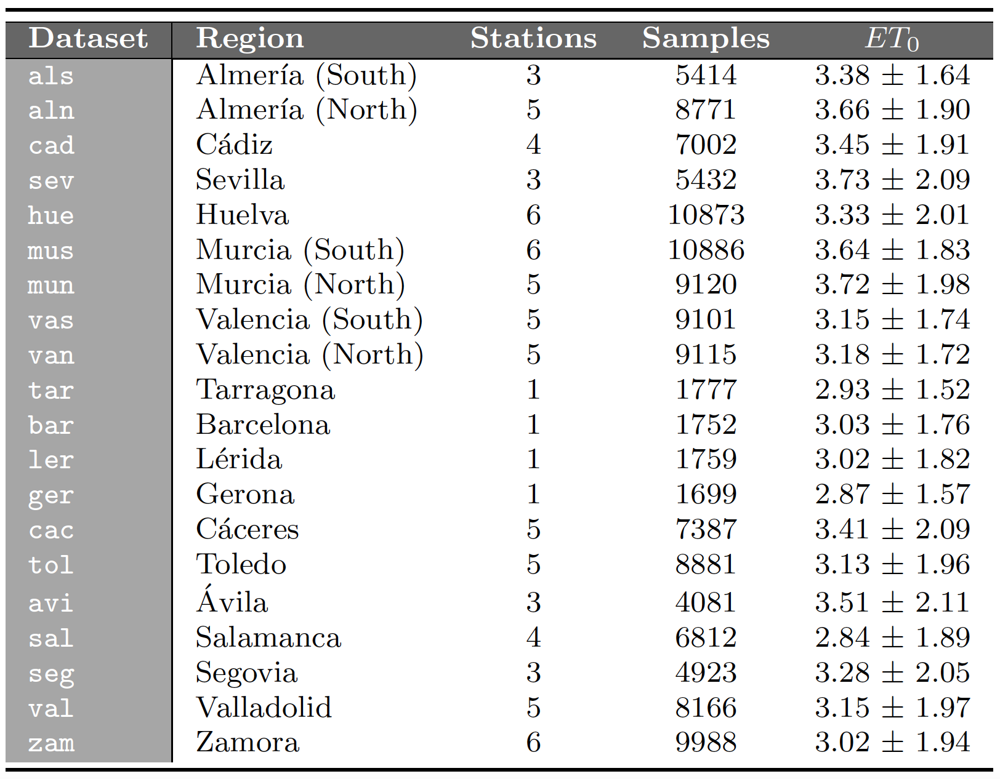

 

This webpage contains complementary material to the research paper:

| | |
|:---|:---|
||Juan Martín, José A. Sáez, Emilio Corchado. **On the suitability of stacking-based ensembles in smart agriculture for evapotranspiration prediction**. [Applied Soft Computing](https://www.journals.elsevier.com/applied-soft-computing), 2021 (submitted).|
| | |

 

The web is organized according to the following summary:

1. [Abstract](#Abstract)
2. [Real-world datasets](#Datasets)
3. [Performance results](#Performance)

 
 
##  1. Abstract
Smart agriculture aims at generating high harvest yields with an efficient resource management, such as the estimation of crop irrigation. One of the factors on which a productive crop irrigation depends on is evapotranspiration, defined as the water loss process from the soil. This is mainly measured by empirical equations, even though they are conditioned by the specific climatological variables they require. In recent years, data mining techniques are proposed as a powerful alternative to predict evapotranspiration. Among them, ensembles are notable in that they provide accurate estimators in different scenarios. Stacking is an ensemble-building technique aimed at strengthening the prediction capabilities of the system by the combined learning from the original features in the data and synthetic features created from the predictions of multiple models. This research proposes the usage of stacking for evapotranspiration prediction, which has been overlooked in the specialized literature, with the aim of a more sustainable management of water resources. The proposal is compared to other state-of-the-art empirical equations and data mining methods over several real-world climatological datasets of different agricultural areas in Spain. This comparison is performed considering separate datasets with features based on temperature, mass transfer, radiation and, finally, using the main meteorological variables together. The results obtained show that stacking is the best approach in all datasets and each group of features evaluated, running as good alternative to predict evapotranspiration when using data of a different nature and under different conditions.

Download the source code [here](https://raw.github.com/juanmartinsantos/et0stacking/master/docs/code.zip).

 
 
 
##  2. Real-world datasets
This research considers daily climatic data from 77 meteorological stations of 20 relevant agricultural areas in Spain. The data are gathered from two important climatic centers devoted to meteorological data treatment in Spain. They cover the daily mean meteorological parameters in the period of 2014–2018.

These datasets can be found in the webpages:

&nbsp;&nbsp;&nbsp;&nbsp;&nbsp;&nbsp;[https://eportal.mapa.gob.es/](https://eportal.mapa.gob.es/)

&nbsp;&nbsp;&nbsp;&nbsp;&nbsp;&nbsp;[https://www.meteo.cat/](https://www.meteo.cat/)

Additionally, they can be downloaded [here](https://raw.github.com/juanmartinsantos/et0stacking/master/docs/datasets.zip).

 

##  3. Performance results

|||
|:---|:---:|
|&nbsp;&nbsp;&nbsp;**-** *RMSE results with temperature variables.* | |
|&nbsp;&nbsp;&nbsp;**-** *RMSE results with mass transfer variables.* | |
|&nbsp;&nbsp;&nbsp;**-** *RMSE results with radiation variables.* | |
|&nbsp;&nbsp;&nbsp;**-** *RMSE results with meteorological variables.* | |
|&nbsp;&nbsp;&nbsp;**-** *MAE results with temperature variables.* | |
|&nbsp;&nbsp;&nbsp;**-** *MAE results with mass transfer variables.* | |
|&nbsp;&nbsp;&nbsp;**-** *MAE results with radiation variables.* | |
|&nbsp;&nbsp;&nbsp;**-** *MAE results with meteorological variables.* | |
|||
