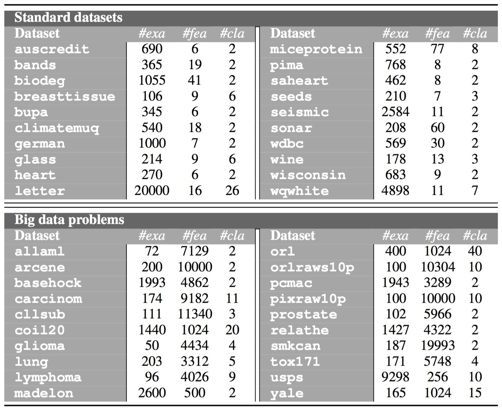

 

This web-page contains complementary material to the research paper:

| | |
|:---|:---|
||José A. Sáez, Emilio Corchado. **KSUFS: A novel unsupervised feature selection method based on statistical tests for standard and big data problems**. [IEEE Access](https://ieeeaccess.ieee.org/), 2019 (submitted).|
| | |

 

The web is organized according to the following summary:

1. [Abstract](#Abstract)
2. [Real-world datasets](#Datasets)
3. [Performance results](#Performance)

 
 
##  1. Abstract
The typical inaccuracy of data gathering and preparation procedures makes erroneous and unnecessary information to be a common issue in real-world applications. In this context, feature selection methods are used in order to reduce the harmful impact of such information in data analysis by removing irrelevant features from datasets. This research presents a novel feature selection method in the field of unsupervised learning, in which the complexity arises from the fact that class labels cannot be used to select the most discriminative features as it is traditionally performed in supervised learning. The technique designed, which is called *Kolmogorov-Smirnov test-based Unsupervised Feature Selection* (KSUFS), is based on the computation of estimated feature distributions that are later compared to the original ones using non-parametric statistical tests to provide the most representative input variables. Two versions of KSUFS are presented in this study: one of them is particularly designed to deal with standard data, in which the accuracy of the method prevalences over other of its aspects; the other version is designed to treat with big data problems, in which the computational complexity is improved due to the characteristics of this type of datasets. KSUFS is successfully compared to other state-of-the-art unsupervised feature selection techniques in a thorough experimental study, which considers both standard and big data problems. The results obtained show that the method proposed is able to outperform the rest of reference unsupervised feature selection methods considered in the comparisons, selecting the first most influential features for standard datasets and particularly highlighting when big data problems are treated.

 
 
##  2. Real-world datasets
The experimentation carried out considers 20 standard real-world datasets and 20 high-dimensional big data problems. The standard datasets chosen cover a wide range of cardinalities regarding to the number of examples (from 106 up to 20000), features (from 6 up to 77) and classes (from 2 up to 26). The big data problems selected are characterized by having more than 250 features. They are also different with respect to the number of examples (from 50 up to 9298), features (from 256 up to 19993) and classes (from 2 up to 40). The following table shows a description of all these 40 datasets, along with the number of examples (*#exa*), features (*#fea*) and classes (*#cla*).

These datasets can be downloaded from the web-page of the [UCI Machine Learning Repository](https://archive.ics.uci.edu/ml/index.php).

 

##  3. Performance results

|||
|:---|:---:|
|&nbsp;&nbsp;&nbsp;**-** *Results with standard datasets* | |
|&nbsp;&nbsp;&nbsp;**-** *Results with big data problems* | |
|&nbsp;&nbsp;&nbsp;**-** *Average performance and standard deviation* | |
|||
