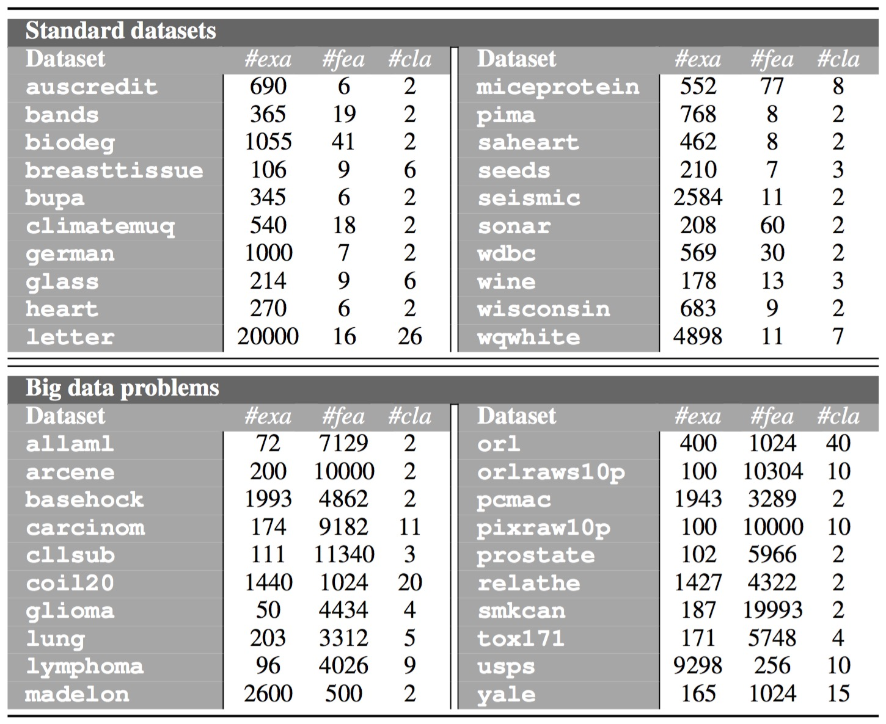

 

This web-page contains complementary material to the research paper:

| | |
|:---|:---|
||Juan Martín, José A. Sáez, Emilio Corchado. **On the suitability of stacking-based ensembles in smart agriculture for evapotranspiration prediction**. [Applied Soft Computing](https://www.journals.elsevier.com/applied-soft-computing), 2020 (submitted).|
| | |

 

The web is organized according to the following summary:

1. [Abstract](#Abstract)
2. [Real-world datasets](#Datasets)
3. [Performance results](#Performance)

 
 
##  1. Abstract
This novel research proposes for the very first time the use of stacking ensembles for evapotranspiration prediction in smart agriculture with the aim of a more sustainable management of water resources. Stacking is an ensemble-building technique aimed at strengthening the prediction capabilities of the system by the combined learning from the original climatological features in the data and synthetic features created from the
evapotranspiration predictions of multiple models. The proposal is successfully compared to other state-of-the-art empirical equations and data mining methods found in the evapotranspiration literature over several real-world climatological datasets of different relevant agricultural areas in Spain. This comparison is performed considering separately datasets with features based on temperature, mass transfer, radiation and, finally, using the main meteorological variables together. The results obtained show that the stacking-based ensemble is clearly the best approach in all datasets and each group of features evaluated, running as a great alternative to predict evapotranspiration when using data of a dierent nature and under different conditions.

 
 
##  2. Real-world datasets
This research considers daily climatic data from 77 meteorological stations of 20 relevant agricultural areas in Spain. The data are gathered from two important climatic centers devoted to meteorological data treatment in Spain. They cover the daily mean meteorological parameters in the period of 2014-2018.

These datasets can be downloaded from the web-page of the [UCI Machine Learning Repository](https://archive.ics.uci.edu/ml/index.php).

 

##  3. Performance results

|||
|:---|:---:|
|&nbsp;&nbsp;&nbsp;**-** *Results in datasets with temperature variables* | |
|&nbsp;&nbsp;&nbsp;**-** *Results in datasets with mass transfer variables* | |
|&nbsp;&nbsp;&nbsp;**-** *Results in datasets with radiation variables* | |
|&nbsp;&nbsp;&nbsp;**-** *Results in datasets with meteorological variables* | |
|||
